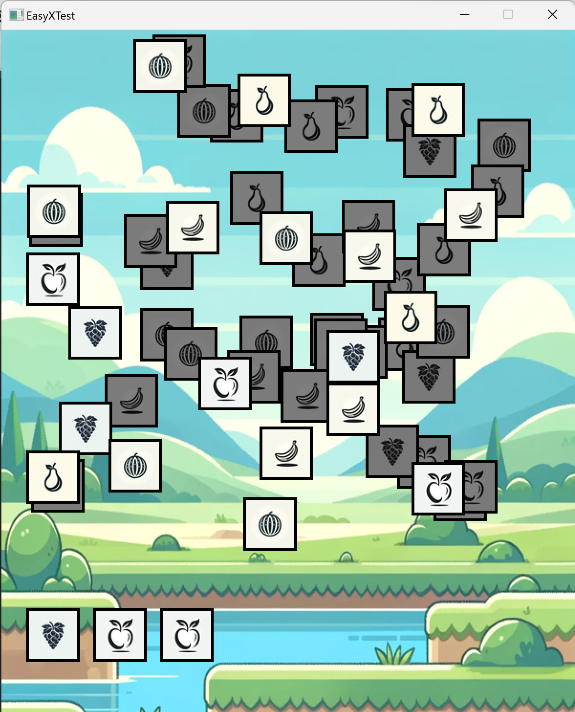
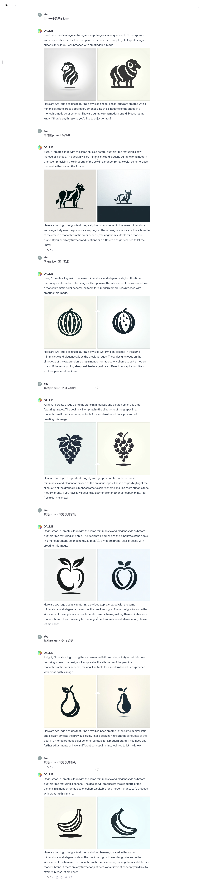
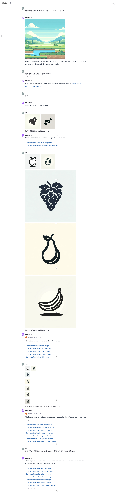

# 羊了个羊_cpp

## 简介

一个使用 C++ 和 EasyX 图形库开发的简单匹配游戏。玩家的目标是通过选择未被覆盖的卡牌来消除相同类型的卡牌。

## 游戏截图


## 特点

- **图形界面**：使用 EasyX 图形库创建。
- **AI生成的图像**：游戏中所有图片都是通过 AI（DALL-E 3）生成。
- **简单游戏机制**：选择和匹配相同类型的卡牌。
- **灵活的游戏设置**：代码中提供了多种参数设置，以调整游戏难度和体验。

## 安装和运行

确保你的系统已安装 EasyX 图形库。

1. 克隆仓库：
   ```sh
   git clone https://github.com/RwandanMtGorilla/yanglegeyang_cpp.git
   ```
2. 打开 `EazyXTest.cpp` 文件。
3. 使用支持 EasyX 的 C++ 开发环境（如 Visual Studio）编译并运行程序。

## 游戏玩法

- 点击未被遮盖的卡牌来移动它们到下方的栈中。
- 当栈中累积了三张相同类型的卡牌时，这些卡牌会被自动消除。
- 游戏的目标是清空所有卡牌，同时避免栈被填满。

## 许可证

[MIT License] © [RwandanMtGorilla]

## 制作过程
### 使用 DALL-E 3 生图

### 使用 codeinterpreter 操作图像
